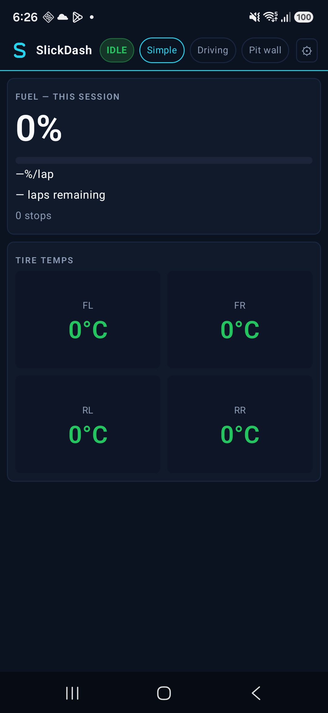
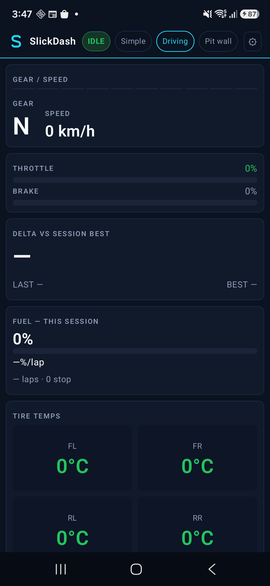
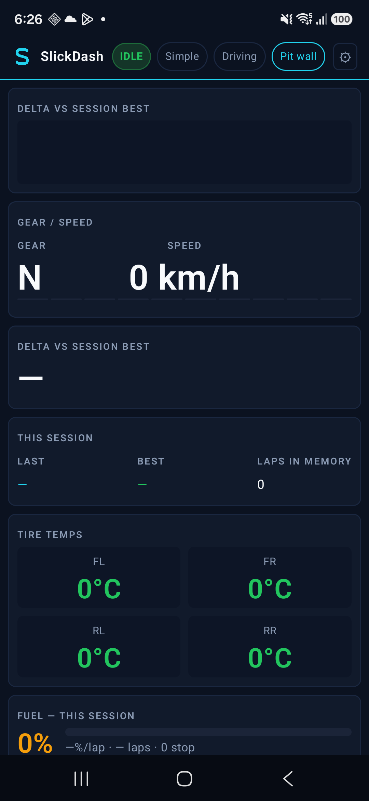
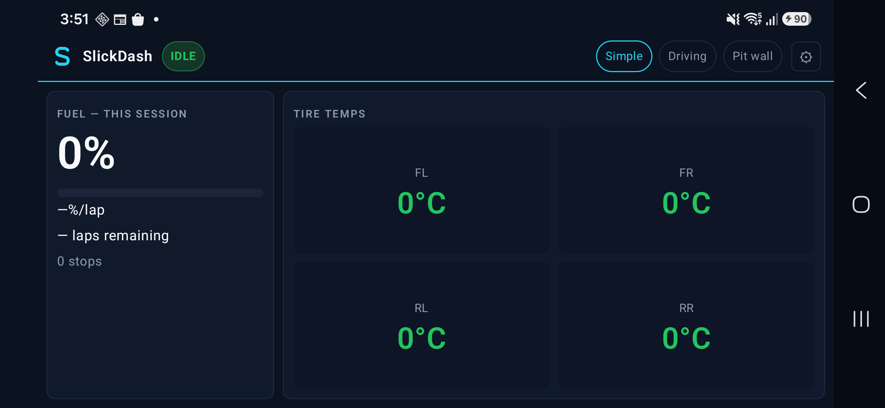
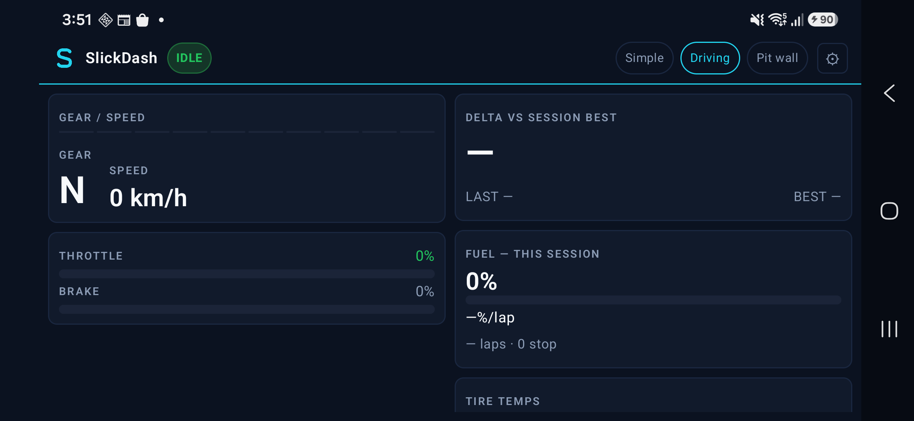
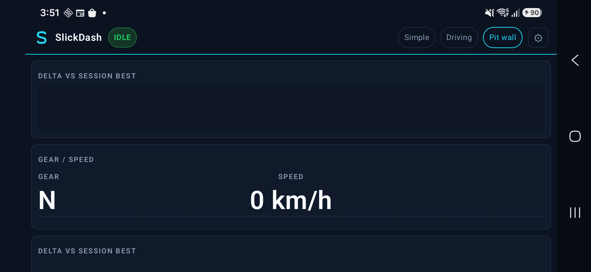

# SlickDash (Android)

Native Kotlin + Jetpack Compose companion for **Gran Turismo 7** live telemetry.

Not affiliated with Sony Interactive Entertainment or Polyphony Digital.

## Screenshots

Samsung Galaxy A17 (SM-A175F). IDLE session — UI layout only.

### Portrait

| Simple | Driving | Pit wall |
| --- | --- | --- |
|  |  |  |

### Landscape

| Simple | Driving | Pit wall |
| --- | --- | --- |
|  |  |  |

## Run

Open in Android Studio, sync Gradle, run on a device on the same LAN as the PS5.

Find PS5 on launch. Simple is the default. Settings cog for manual IP.

Requires Android 8+ (API 26). LAN UDP to GT7 (heartbeat 33739, receive 33740).

## CI

GitHub Actions builds a debug APK and runs unit tests on every PR. No signing secrets or Sentry auth tokens are used.
